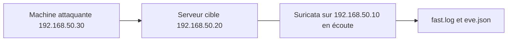

# Lab sécurité : détection d'intrusion avec Suricata

> **Statut : à réaliser.** Ce guide est préparé à partir de la documentation officielle et de mes cours ; **je ne l'ai pas encore rejoué de bout en bout**. Les commandes sont à valider en le faisant, et le journal en bas de page sera complété avec mes résultats réels (captures, erreurs rencontrées, corrections).
>
> **Commandes vérifiées :** ce guide a été rejoué dans un conteneur Debian 13 (22 septembre 2026 ; sur Debian 12 le paquet `suricata` demande les dépôts *backports*, précisé dans le guide) avec le vrai Suricata : `suricata -T` valide la configuration et les deux règles, et refuse une règle avec un `sid` en double. En rejouant une vraie capture réseau, la règle ICMP a déclenché exactement 2 alertes pour 2 pings, la règle sur l'en-tête `User-Agent` a déclenché 1 alerte pour une requête HTTP imitant Nmap, et aucune alerte ne s'est déclenchée pour du trafic hors de `HOME_NET`. Vérifié ne veut pas dire réalisé : c'est l'assistant IA qui a préparé ce guide qui a rejoué ces commandes dans un conteneur jetable, pas moi sur mon propre lab. Le journal ci-dessous reste à remplir une fois que je l'aurai fait moi-même.

## Objectif

Installer **Suricata**, un système de détection d'intrusion (IDS) : il observe le trafic d'une interface et **génère une alerte** quand un paquet correspond à une règle. Écrire ses propres règles, puis vérifier qu'un ping ou un scan Nmap est bien détecté.

## Prérequis

- Une VM **Debian 12** (Suricata, avec une interface qui voit le trafic à observer) et une machine « attaquante » sur le même réseau.
- Notions : protocoles réseau (ICMP, TCP), lecture d'une capture. Un IDS **observe** et alerte, il ne bloque pas (c'est le rôle d'un IPS ou d'un pare-feu).

## Topologie



Pour que Suricata voie le trafic d'un autre hôte, l'installer **sur la cible elle-même** (le plus simple), ou brancher un port de switch en miroir (SPAN).

## Étapes

### 1. Installer et mettre à jour les règles

```bash
sudo apt update && sudo apt install -y suricata
sudo suricata-update            # télécharge l'ensemble de règles Emerging Threats Open
```

### 2. Régler le réseau surveillé et l'interface

Dans `/etc/suricata/suricata.yaml` :

Fichier du dépôt : [`configs/suricata.yaml.extrait`](configs/suricata.yaml.extrait)

```yaml
vars:
  address-groups:
    HOME_NET: "[192.168.50.0/24]"

af-packet:
  - interface: enp0s8
```

Remplacer `enp0s8` par l'interface réelle (`ip -br a`).

### 3. Écrire une règle locale

Créer `/var/lib/suricata/rules/local.rules` (vérifier la valeur de `default-rule-path` dans `suricata.yaml` : c'est le dossier où Suricata cherche les fichiers de `rule-files`) :

Fichier du dépôt : [`configs/local.rules`](configs/local.rules)

```text
alert icmp any any -> $HOME_NET any (msg:"LAB ICMP echo request detecte"; itype:8; sid:1000001; rev:1;)
alert http any any -> $HOME_NET any (msg:"LAB User-Agent Nmap Scripting Engine"; http.user_agent; content:"Nmap Scripting Engine"; sid:1000002; rev:1;)
```

Déclarer ce fichier dans `suricata.yaml`, dans la liste `rule-files` :

```yaml
rule-files:
  - suricata.rules
  - local.rules
```

Anatomie d'une règle : **action** (`alert`), **protocole**, **source** → **destination**, puis les **options** entre parenthèses : `msg` (texte de l'alerte), `content` (motif à repérer), `sid` (identifiant unique ; les valeurs à partir de 1 000 000 sont réservées aux règles locales).

### 4. Tester la configuration et démarrer

```bash
sudo suricata -T -c /etc/suricata/suricata.yaml -v     # vérifie la configuration et les règles
sudo systemctl restart suricata
sudo systemctl status suricata
```

## Vérifications

Depuis la machine attaquante :

```bash
ping -c 3 192.168.50.20
nmap -sS -p 1-1000 192.168.50.20        # scan SYN (réseau de labo uniquement)
nmap -sV --script http-title 192.168.50.20
```

Sur le serveur :

```bash
sudo tail -f /var/log/suricata/fast.log                        # une ligne par alerte
sudo apt install -y jq                                         # pour lire eve.json
sudo jq 'select(.event_type=="alert") | .alert.signature' /var/log/suricata/eve.json | tail
```

Attendus : l'alerte `LAB ICMP echo request detecte` pour le ping et l'alerte sur le *User-Agent* Nmap avec le script HTTP (les deux viennent de mes règles locales, donc certaines). Pour le balayage de ports, des alertes de la famille `ET SCAN` peuvent apparaître selon les règles chargées : à noter dans le journal, avec les signatures effectivement observées.

Pour comprendre ce que voit Suricata, comparer avec la capture d'un scan dans Wireshark : [tp-wireshark-analyse-trafic](https://github.com/mehdiseg/tp-wireshark-analyse-trafic) et son exercice de balayage de ports. Le scan se prépare avec [nmap-audit-reseau-local](https://github.com/mehdiseg/nmap-audit-reseau-local). À ne lancer que sur son propre laboratoire.

## Pièges fréquents

- Suricata écoute la mauvaise interface : aucune alerte.
- `HOME_NET` ne contient pas le réseau du labo : les règles qui l'utilisent ne se déclenchent pas.
- `local.rules` non listé dans `rule-files`, ou `sid` en double : la vérification `-T` signale l'erreur.
- Règles non mises à jour (`suricata-update` oublié) : peu de règles chargées.
- Le *offloading* de la carte réseau peut fausser l'analyse : `sudo ethtool -K enp0s8 gro off lro off` (sur les cartes virtuelles).

## Pour aller plus loin

- Passer en mode **IPS** (blocage en ligne) avec `nfqueue` ou `af-packet` en pont.
- Visualiser les alertes avec une pile Elasticsearch/Kibana ou Wazuh.
- Écrire une règle qui détecte un trafic précis de son propre réseau (par exemple Telnet, port 23).
- Corréler avec les bannissements de [lab-fail2ban-ssh-durcissement](https://github.com/mehdiseg/lab-fail2ban-ssh-durcissement).

## Références

- [Documentation de Suricata](https://docs.suricata.io/en/latest/)
- [Écrire des règles Suricata](https://docs.suricata.io/en/latest/rules/index.html)

## Journal de réalisation

_Lab pas encore réalisé : cette section sera remplie au fur et à mesure._

| Date | Ce que j'ai fait | Résultat | Difficultés et solutions |
|---|---|---|---|
|  |  |  |  |

## Feuille de route

Ce lab fait partie de ma [feuille de route réseau](https://github.com/mehdiseg/roadmap-reseau-bts-sio).

## Licence

[MIT](LICENSE)
